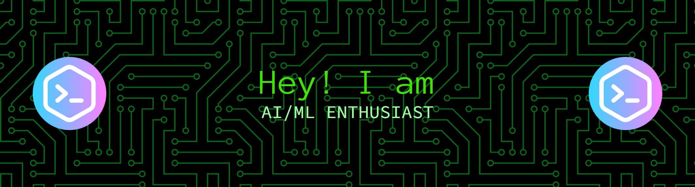

  

  <h3>AI Engineer • Full-Stack Developer • Machine Learning Enthusiast</h3>

  

    
    
    
    
  

---

## 👨‍💻 About Me

I am a B.Tech Computer Science Engineering undergraduate specializing in **Artificial Intelligence & Machine Learning** at **Vellore Institute of Technology, Bhopal** (2024 – 2028)[cite: 1, 2]. 

I enjoy building production-ready AI products that combine modern software engineering with machine learning. My work spans full-stack web applications, retrieval-augmented generation (RAG) systems, developer tools, and data-driven architectures[cite: 1, 2]. I focus on writing clean, scalable software while continuously improving my understanding of system design, backend architecture, and distributed systems.

---

## 💼 Experience

*   **Machine Learning Engineering Intern** at *FlyRank AI* (Jul 2026 – Aug 2026): Contributing to AI/ML model development, data pipelines, and production machine learning features[cite: 1, 2].
*   **Web Developer Intern** at *Webyou Technologies* (May 2026 – Jul 2026): Built responsive web applications and supported senior developers in implementing frontend and backend features[cite: 1, 2].
*   **Artificial Intelligence Intern** at *Navodita Infotech* (May 2025 – Jun 2025): Worked on AI-driven tasks involving data handling, model exploration, and applied machine learning[cite: 1, 2].
*   **Writer & Content Creator** at *Kraaft Entertainment* (Jan 2025 – Present): Produced technical and non-technical content for digital platforms[cite: 1, 2].

---

## 🚀 Featured Projects

### 🧠 Enterprise AI & RAG Platforms
*   **RAGForge:** A multi-tenant RAG SaaS platform enabling businesses to deploy branded AI chatbots grounded in their own documents (PDF/DOCX/TXT) using pgvector and the Gemini API[cite: 1, 2].
*   **RCA Copilot:** An AI-powered incident investigation platform that generates structured Root Cause Analysis reports in under 30 seconds from raw logs and descriptions, featuring blast radius analysis[cite: 1, 2].

### ⚙️ Developer Tools & Automation
*   **CI/CD AI Pipeline:** An intelligent CI/CD system that captures GitHub webhook failures, generates auto-fixes using Gemini API, tests them in Docker, and automatically opens Pull Requests[cite: 1, 2].
*   **StackSensei:** An AI codebase analysis platform supporting natural language prompts, file uploads, and direct GitHub URLs to help developers understand unfamiliar code[cite: 1, 2].
*   **LikhAI:** An AI-powered handwriting automation platform that generates realistic handwritten assignments and notebooks using a user's personal handwriting style.

### 📊 Machine Learning & Data
*   **AirPredict NYC:** A production-ready ML application predicting Airbnb listing prices using Linear Regression, Random Forest, and XGBoost, featuring SHAP explainability and KNN recommendations[cite: 1, 2].

---

## 🛠️ Tech Stack

**Languages:** Java, Python, C++, SQL, JavaScript, TypeScript, HTML/CSS[cite: 1, 2]  
**Frontend:** React, Next.js, HTML/CSS, Tailwind, Bootstrap[cite: 1, 2]  
**Backend:** Node.js, Express.js, Flask, FastAPI[cite: 1, 2]  
**Databases:** PostgreSQL, Supabase, MySQL, pgvector[cite: 1, 2]  
**AI/ML:** RAG Systems, Vector Embeddings, XGBoost, SHAP, OpenCV, PyTorch, TensorFlow, Google Gemini API, OpenAI API[cite: 1, 2]  
**DevOps & Tools:** Git, GitHub Actions, Docker, Linux, Vercel, Postman, Prisma ORM[cite: 1, 2]

  

---

  
  
  

  
  

    
  
  <h3>🐍 Contribution Snake</h3>
  <picture>
    <source media="(prefers-color-scheme: dark)" srcset="https://raw.githubusercontent.com/anshere0/anshere0/output/github-snake-dark.svg">
    <source media="(prefers-color-scheme: light)" srcset="https://raw.githubusercontent.com/anshere0/anshere0/output/github-snake.svg">
    
  </picture>

  <i>Building intelligent software that solves real-world problems through AI, modern engineering, and continuous learning.</i>

